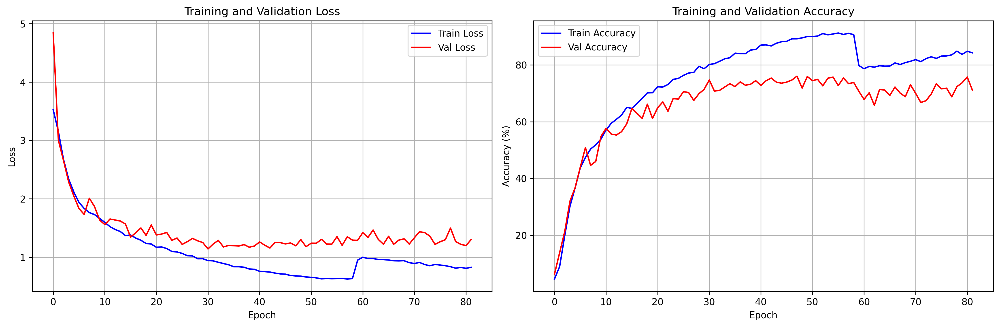
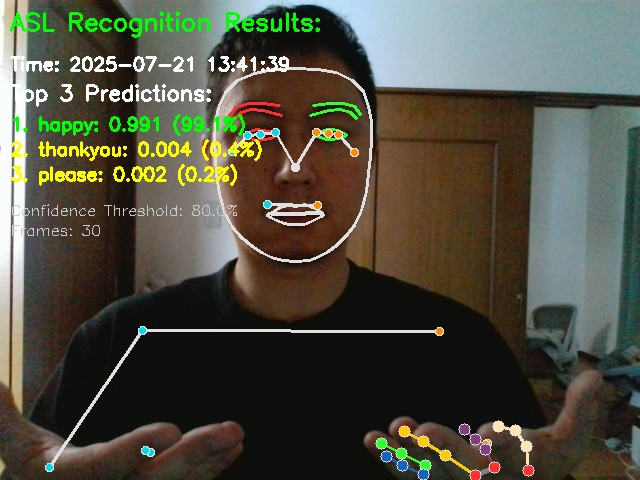

# 🤟 Google ASL Recognition

A comprehensive American Sign Language (ASL) recognition system based on the winning solution from Google's ASL Signs competition, adapted for PyTorch and optimized for RTX4070 GPUs.

## 🎯 Project Overview

This project implements a state-of-the-art ASL recognition model that can:
- **Train** on the Google ASL Signs dataset (25 most common gestures)
- **Capture** real-time gestures using MediaPipe
- **Recognize** ASL signs from video input with 76.05% accuracy
- **Compare** captured gestures with dataset samples

The model architecture combines TCN, LSTM, and Transformers with adaptive regularization, achieving competitive accuracy while being optimized for modern GPUs.

### 📊 Dataset Source

This project uses a subset of the **Google ASL Signs** dataset from the Kaggle competition:
- **Competition**: [ASL Signs - American Sign Language Recognition](https://www.kaggle.com/competitions/asl-signs/overview)
- **Original Dataset**: Contains 250 ASL signs with hand landmark data
- **Project Dataset**: Extracted 25 most common ASL signs for focused training
- **Citation**: [Kaggle Competition Citation](https://www.kaggle.com/competitions/asl-signs/overview/citation)
- **Format**: Parquet files with MediaPipe landmarks (543 points per frame)

### 🎯 Recognized Gestures (25 ASL Signs)

**Greetings & Courtesy**: hello, please, thankyou, bye  
**Family**: mom, dad, boy, girl, man, child  
**Actions**: drink, sleep, go  
**Emotions**: happy, sad, hungry, thirsty, sick, bad  
**Colors**: red, blue, green, yellow, black, white  

## 📈 Project Evolution

### Initial Vision vs. Reality

The project started with an ambitious 7-day roadmap (see `PREPARE.md`) targeting 80-85% accuracy using Vision Transformers and CNN ensembles. However, reality led to a more focused and practical approach:

**Original Plan:**
- Vision Transformer + CNN ensemble
- 250 ASL gestures
- 80-85% target accuracy
- 7-day intensive development

**Actual Implementation:**
- Hybrid TCN + LSTM + Transformer architecture
- 25 most common ASL gestures
- 76.05% achieved accuracy
- Focused, production-ready solution

This evolution resulted in a more practical, maintainable system optimized for real-world deployment rather than competition-level performance.

## 🏗️ Architecture

### Model Components
- **TCN Blocks**: 3 layers with dilations (1,2,4) for local temporal patterns
- **Bidirectional LSTM**: 2 layers for long-term dependencies
- **Temporal Attention**: 8 heads for focusing on important frames
- **Conv1D + Transformer**: Hybrid processing for final classification
- **Adaptive Regularization**: Dropout, LateDropout, AWP for overfitting prevention

### Model Structure
```
Input (seq_len, landmarks, 3)
    ↓
Preprocessing (normalization, motion features)
    ↓
Stem (Linear + BatchNorm + AdaptiveDropout)
    ↓
TCN Blocks (3 layers, dilations 1,2,4)
    ↓
Bidirectional LSTM (2 layers)
    ↓
Temporal Attention (8 heads)
    ↓
Conv1D Block × 3 + Transformer Block
    ↓
Multi-scale Pooling (avg + max + attention)
    ↓
Classifier (25 classes)
```

## 📊 Results & Visualizations

### Training Progress


The training history shows stable convergence with the model achieving 76.05% validation accuracy. The loss curves demonstrate effective regularization preventing overfitting while maintaining learning capacity.

### Live Recognition Demo


Real-time ASL recognition in action, demonstrating the system's ability to capture and classify gestures with MediaPipe landmarks and visual feedback.

## 🚀 Quick Start

### Prerequisites
- Python 3.10+
- CUDA-compatible GPU (RTX4070 recommended)
- Webcam for gesture capture

### Installation

1. **Clone the repository**
```bash
git clone <repository-url>
cd google_asl_recognition
```

2. **Create and activate virtual environment**
```bash
# Create virtual environment
python -m venv .venv

# Activate on Windows
.venv\Scripts\activate

# Activate on Linux/Mac
source .venv/bin/activate
```

3. **Install PyTorch with CUDA 12.1**
```bash
# Install PyTorch with CUDA support
pip install torch torchvision torchaudio --index-url https://download.pytorch.org/whl/cu121
```

4. **Install all dependencies**
```bash
# Install all required packages
pip install -r requirements.txt
```

## 📁 Project Structure

```
google_asl_recognition/
├── data/                          # Dataset storage
│   └── google_asl_signs/         # Original dataset
├── manual/                        # Main project directory
│   ├── dataset25/                # Processed dataset (25 signs)
│   ├── dataset25_split/          # Train/test split
│   ├── models/                   # Trained models and manifests
│   ├── utils/                    # Utility scripts
│   ├── step1_extract_words.py    # Data extraction
│   ├── step1.2_split_train_test.py # Dataset splitting
│   ├── step2_prepare_dataset.py  # Dataset preparation
│   ├── step3_prepare_train.py    # Training script
│   ├── step4_capture_mediapipe.py # Gesture capture
│   └── step5_live_recognition.py # Live recognition
├── docs/                         # Documentation
│   ├── README.md                 # Documentation overview
│   ├── training.md               # Training guide
│   ├── data-preparation.md       # Data preparation guide
│   ├── live-recognition.md       # Live recognition guide
│   ├── manifest-system.md        # Manifest system guide
│   └── pictures/                 # Screenshots and images
├── demo/                         # Demo scripts
├── PREPARE.md                    # Original project roadmap
└── requirements.txt              # Dependencies
```

## 🎮 Usage

### 1. Data Preparation

```bash
cd manual

# Extract and prepare the dataset
python step1_extract_words.py
python step1.2_split_train_test.py
python step2_prepare_dataset.py
```

### 2. Model Training

```bash
# Start training
python step3_prepare_train.py
```

**Training Configuration for RTX4070:**
- **Epochs**: 300 (full training) or 50 (testing)
- **Batch Size**: 32 (optimized for RTX4070)
- **Expected Time**: ~1.75 hours for full training
- **Expected Accuracy**: ~76.05% validation score

### 3. Live Recognition

```bash
# Test camera
python test_camera.py

# Run live ASL recognition
python step5_live_recognition.py
```

## 🔧 RTX4070 Optimizations

The project includes specific optimizations for RTX4070:
- **TF32**: Enabled for Ampere architecture acceleration
- **Mixed Precision**: Automatic FP16 usage
- **cuDNN Benchmark**: Optimized convolution algorithms
- **Memory Optimization**: Automatic batch size tuning
- **Adaptive Dropout**: Gradual regularization activation

## 📊 Latest Results

### Model Performance
- **Model**: `asl_model_v20250720_080209`
- **Architecture**: Enhanced TCN + LSTM + Transformer v2
- **Validation Accuracy**: 76.05%
- **Parameters**: 1.97M
- **Training Time**: ~1.75 hours
- **Classes**: 25 ASL gestures

### Training Configuration
- **Loss**: CrossEntropyLoss with label smoothing (0.05)
- **Optimizer**: AdamW with weight decay (0.005)
- **Scheduler**: CosineAnnealingWarmRestarts
- **Regularization**: Adaptive Dropout, TCN Dropout, Attention Dropout

## 🎥 Live Recognition Features

### MediaPipe Integration
- **Face Landmarks**: 468 points
- **Pose Landmarks**: 33 points
- **Hand Landmarks**: 21 points per hand
- **Total**: 543 landmarks per frame

### Recognition Controls
- **'q'**: Stop recognition
- **'s'**: Save current screenshot
- **'r'**: Reset frame buffer
- **'h'**: Show/hide help
- **Real-time preview**: Visual feedback during recognition

## 📈 Model Versioning

The project includes a comprehensive manifest system for tracking model versions:
- **Date-based naming**: `asl_model_vYYYYMMDD_HHMMSS.pth`
- **Training manifests**: Detailed training history and parameters
- **Final manifests**: Best model selection with performance metrics
- **Complete tracking**: All experiments and improvements documented

## 📚 Documentation

Comprehensive documentation is available in the `docs/` directory:

- **[Documentation Overview](docs/README.md)** - Complete documentation guide
- **[Training Guide](docs/training.md)** - How to train the model
- **[Data Preparation](docs/data-preparation.md)** - Dataset preparation process
- **[Live Recognition](docs/live-recognition.md)** - Real-time gesture recognition
- **[Manifest System](docs/manifest-system.md)** - Model versioning and tracking
- **[RTX4070 Optimizations](docs/rtx4070-optimizations.md)** - GPU-specific optimizations
- **[Model Architecture](docs/architecture.md)** - Detailed model architecture
- **[Model Results](docs/model-results.md)** - Performance analysis and results
- **[Quick Start](docs/quickstart.md)** - Quick start guide
- **[Installation](docs/installation.md)** - Detailed installation instructions

## 🤝 Contributing

1. Fork the repository
2. Create a feature branch
3. Make your changes
4. Add tests if applicable
5. Submit a pull request

## 📄 License

This project is based on the winning solution from Google's ASL Signs competition. Please refer to the original competition terms and conditions.

## 🙏 Acknowledgments

- **Kaggle Competition**: [ASL Signs - American Sign Language Recognition](https://www.kaggle.com/competitions/asl-signs/overview) organizers and participants
- **Dataset**: Google ASL Signs dataset provided by the competition
- **MediaPipe team** for hand tracking and landmark extraction
- **PyTorch community** for the deep learning framework
- **Original competition winners** for the model architecture inspiration

## 📞 Support

For issues and questions:
1. Check the documentation in the `docs/` directory
2. Review existing issues
3. Create a new issue with detailed information

---

**Note**: This project requires a CUDA-compatible GPU for optimal performance. CPU-only mode is available but significantly slower.

**Ready to recognize ASL gestures! 🤟**